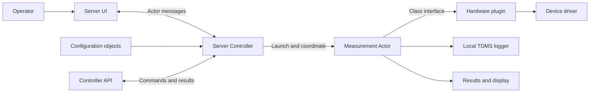

# LabVIEW MAL Reference

<!-- labview-ci:dashboard -->
## LabVIEW CI

[](https://elijah286.github.io/labview-mal-reference/)

LabVIEW CI runs on every pull request. See the [**CI dashboard**](https://elijah286.github.io/labview-mal-reference/) for build status, VI Analyzer results, VI diffs, and mass-compile reports.

An updated, native LabVIEW reference example for building extensible test and
measurement applications with hardware abstraction, measurement abstraction,
configuration objects, and asynchronous actors.

**Under active development.** Local operation was confirmed by the user on
October 7, 2026, after correcting initialization for local hardware discovery.
This is a development reference, not a production-qualified test system or a
certified shutdown/safety implementation. This is the initial author-authorized
development snapshot for [elijah286/labview-mal-reference](https://github.com/elijah286/labview-mal-reference).
Recovered NI dependency source is obtained separately, not republished. Clean-checkout
and lifecycle verification remain in progress; see [Publication Status](docs/PUBLICATION.md).

## What This Example Is

This work updates Elijah Kerry's Measurement Utility / Measurement Abstraction
Framework example for a LabVIEW 2026, Windows 64-bit development environment.
Its starting point is the original multi-repository application and framework,
not a new implementation of those ideas and not an exact copy of the NIWeek 2018
5.3 package distribution.

The central idea is to separate **what a measurement does**, **which instrument
performs it**, and **how the application coordinates and displays it**. A hardware
plugin wraps a device driver behind a common class interface. A measurement plugin
expresses a measurement workflow. A controller coordinates actors, configuration,
device selection, and results without embedding every device's implementation.

The updated reference retains those concepts and their native G implementations.
Its changes concentrate on recovered dependencies, broken source/call links,
local startup, and a narrower local TDMS logging path. Application logic does not
require Python, PowerShell, GitHub Copilot, or MCP to run; those tools were used
for inspection and repair, not as the application's runtime.

## Who Should Use It

- LabVIEW developers learning to apply classes and Actor Framework to a realistic
  multi-component measurement application rather than a minimal messaging demo.
- Test-system architects evaluating separation of measurement logic, drivers,
  operator interaction, configuration, and logging.
- Teams extending a measurement system with additional instruments or workflows
  and wanting to study the relevant class and message contracts.
- Maintainers investigating the practical work involved in updating an older
  native LabVIEW reference to a newer toolchain and dependency environment.

Basic familiarity with LabVIEW classes, dynamic dispatch, error clusters, queues,
and Actor Framework is useful. This is not the simplest starting point for a
first LabVIEW application, a complete battery test product, or a drop-in device
driver suite.

## How It Works

| Part | Responsibility | Concept To Study |
| --- | --- | --- |
| Server Controller | Owns the application-level coordination and dispatches work | Actor composition and message-based orchestration |
| Server UI / Measurement UI | Displays configuration, measurements, status, and results | Separating operator interaction from measurement execution |
| Measurement Actor | Runs a configured measurement workflow | Measurement abstraction and independently executing workflows |
| Hardware classes | Wrap device-specific configuration, acquisition, and generation | HAL interfaces and substitutable device implementations |
| Configuration classes | Store common and device/measurement-specific settings | Extensible configuration and persistence |
| Logger / Results actors | Receive data and expose persistence/results behavior | Decoupling data production, logging, and presentation |
| Controller API | Provides an integration surface outside the operator UI | Reuse without coupling callers to panel internals |



This is a conceptual map, not a timing guarantee or an exhaustive message diagram.
The original framework supports plugin factories and dynamic loading. Those
extension points remain part of the example; they require deliberate configuration
and deployment testing rather than an assumption that any arbitrary plugin will
load or operate safely.

A typical workflow is to load configuration, resolve available hardware and
measurement plugins, select the relevant device/channel mapping, launch a
measurement, deliver data to logging/results actors, and stop the owned activity.
Device implementations expose their own configuration/acquisition/generation
behavior through the HAL. A measurement can specialize the workflow or display
without putting device-driver code into the application controller.

## Why These Boundaries Matter

**Reuse:** Measurements can depend on an interface rather than a specific device,
and the controller/API can reuse workflows outside a single front panel.

**Extensibility:** Hardware, measurement, configuration, and result behavior have
distinct extension points. New implementations do not need to become additional
branches in one monolithic top-level diagram.

**Concurrency:** Actors let UI, measurement, logging, and results proceed
independently. That independence also makes ownership and termination harder:
closing a panel is not proof that an actor has stopped.

**Maintainability:** Small, purpose-specific classes and explicit messages make
responsibilities easier to inspect. The tradeoff is a larger dependency graph,
more message/class files, and careful version management.

## What Changed

| Area | Original / Recovered Baseline | This Update |
| --- | --- | --- |
| Environment | Older source/package baselines; the original article documents LabVIEW 2017 SP1 and a 2018 5.3 distribution | Targeted and inspected in LabVIEW 2026, Windows 64-bit; no older-version compatibility claim |
| Source organization | Application, framework, API, configuration, and plugin repositories were separate | Consolidated reference project plus pinned source/dependency provenance |
| Local startup | Called Find Systems to discover network systems even though its system list was unused | Uses Initialize Session for the same explicit local target; avoids the unnecessary network-discovery dependency |
| DAQ source links | Missing legacy configuration readers/writers and inconsistent library ownership | Corrected native ownership; relinked existing configuration accessors; recovered a missing native configuration member |
| DAQ configuration | Legacy UI/serializers referenced an absent IO Channels field | Restored the string field and rebound existing in-place element selections |
| Logging | Included AMQP/Skyline/SystemLink setup, upload, and cleanup dependencies | Local TDMS path retained; remote upload disabled; direct disabled requests return a descriptive error |
| ZIP | Existing calls did not match the available OpenG ZIP installation | Relinked to the installed 64-bit-compatible OpenG ZIP 5.0.9 Path instance |
| Startup/lifecycle | Auto-run on open and several shutdown/error-path defects complicated inspection | Auto-run disabled; registration ordering and controller-to-UI Stop behavior corrected; full lifecycle verification remains development work |
| Dependencies | Installed-library paths and mixed historical package expectations | Project-local source recovery where possible, explicit external prerequisites, and retained package notices |

See [Changes From Upstream](CHANGES.md) for the precise source baselines,
subject-level repairs, diagnostic cleanup, and changes that must not be
mistaken for completed fixes. The detailed historical [Native Repair Ledger](NATIVE-REPAIRS.md)
is supporting evidence, not a replacement for the current status below.

## Current Verification

| Check | Result |
| --- | --- |
| Local application operation | User-confirmed working on October 7, 2026 |
| Corrected local initialization | Native runtime trace: status false, code 0, empty source while NI Network Discovery remained stopped |
| Native compilation | Selected subject checks passed in the reference project's application instance; not every plugin was certified |
| Standard Measurement plugin | Six methods compile; native factory loading, buffered-data simulation, timeout/fault checks, diagram sizing, and live Step-menu discovery passed |
| Automated normal-close regression | Not passed; its last attempt had no UI handle before a close request and reported reserved/running actor states |
| Fault termination / repeat start-stop | Not fully verified |
| Acquisition, TDMS round-trip, connected hardware | Not established by the startup checks |
| Clean-checkout setup / executable build | Not yet verified |

The original startup error was captured as -2147467259 from NI System
Configuration's Find Systems call. The replacement local session path removed
that error without changing any system service. This does not imply that all
network features or device drivers have been validated.

## Environment And Setup

The working development environment uses LabVIEW 2026 **64-bit** on Windows,
the built-in Actor Framework, NI-DAQmx, NI System Configuration, and OpenG ZIP
5.0.9 with a compatible x64 native library. See [Source Dependencies](SOURCE-DEPENDENCIES.md)
for the recovered package versions and external prerequisites. Do not install a
second older Actor Framework over the version supplied with LabVIEW.

The inherited class/message folder names are long. On Windows, enable Git long-path
handling for this checkout and choose a short destination:

```powershell
git clone --config core.longpaths=true https://github.com/elijah286/labview-mal-reference.git C:/src/mal-reference
```

This setting applies to the new repository, not your global Git configuration.
A successful checkout still needs the dependency and native-runtime checks below.

There is not yet a verified clean-clone installer. Temporary tooling and unrelated
workspace entries have been removed from the root project. CVT/LNA project entries
now use the documented external dependency locations, not local recovery folders.
Recovered NI sources are excluded from Git. Use
[Prepare-ExternalDependencies.ps1](tooling/Prepare-ExternalDependencies.ps1) to
populate them from authorized copies; it runs no installers and refuses to replace
different files. Native binary links may still need resolution in LabVIEW. The
bundled Measurements.ini contains historical hardware/logging paths and example
device names, not working defaults for a new machine. Its measurement search
path now points to this checkout's components/Measurements folder. See
[Measurement Plugin Repair](docs/MEASUREMENT-PLUGIN-REPAIR.md) for verified scope
and the three required hardware roles.

For an authorized development copy:

1. Obtain the dependencies from their licensed distributions and confirm x64
   support. Preserve their notices; source vendoring does not replace a driver.
   See [Source Dependencies](SOURCE-DEPENDENCIES.md) for excluded NI packages.
2. Open [Measurement Utility Reference.lvproj](Measurement%20Utility%20Reference.lvproj).
   Resolve dependencies deliberately. Do not accept an unrelated same-name VI as
   a substitute for a missing class method.
3. Review [Measurements.ini](components/HAL-MAL-Application/Source/Framework/Measurements.ini)
   through the application's configuration interfaces. Choose local plugin folders,
   explicit device/channel mappings, and a writable log location. Do not edit
   flattened logger-class values by guessing their encoding.
4. For hardware-free development, explicitly configure an NI-DAQmx simulated
   device in MAX or an appropriate provided simulated instrument class. An empty
   hardware list is not a successful simulation.
5. Open the server controller's [main.vi](components/HAL-MAL-Application/Source/Framework/Server/Controller/main.vi)
   front panel and run it deliberately. Automatic run-on-open is disabled.
6. Start only a configured measurement, verify its data and log, and verify normal
   Stop before starting another run. If the UI disappears and project items stay
   locked, stop and inspect the actor lifecycle rather than launch a duplicate.

TestStand, remote client/server execution, SystemLink upload, and executable
deployment are not prerequisites for the verified local startup path. Their
presence as historical source does not establish runtime support in this update.

## Extending The Example

**A hardware plugin:** derive from the existing hardware interface and implement
the required driver operations and configuration behavior. Give each read/write
an explicit device timeout and a defined error/cleanup contract. Start with a
simulated or safely isolated target; do not silently substitute one device for another.

**A measurement plugin:** derive from the measurement abstraction when you need
different acquisition/generation behavior, calculations, hardware requirements,
or a specialized display. Keep those decisions separate from driver-specific code.

**Configuration and results:** extend the corresponding classes when a plugin
needs additional settings or result presentation. Test serialization round-trips
and old configuration compatibility rather than relying only on native compilation.

**Actor lifecycle:** keep the caller/enqueuer relationships explicit. Every launched
actor needs an owner, an accessible Stop path, and observable termination. Do not
copy the inherited discarded errors or unlimited waits as recommended practice.
Fault-safe event creation is one correction here, not a complete bounded supervisor.

## Repository Guide

| Location | Contents |
| --- | --- |
| components/HAL-MAL-Application | Server/client application examples and startup |
| components/MAL-Framework | Controller, measurement, hardware, logging, UI, and result abstractions |
| components/MAL-Framework-API | Controller-facing integration API |
| components/Extensible-Config-Dialog | Configuration classes and dialog implementation |
| components/Hardware | Concrete DAQ and simulated instrument source |
| components/GUID-API | GUID source |
| components/TestStand-MAL-API | Optional historical TestStand integration source |
| vendor | OpenG source and package notices; recovered NI payload source is excluded |
| tooling | Portable source audit and external-dependency preparation, not runtime logic |
| dependency-lock.json | Recorded revisions, package versions, and recovery hashes |

Local recovery archives, runtime traces, personal LabVIEW state, and temporary
probes must not become part of a published application checkout.

## Active Development

The temporary initialization recorder has been removed natively and the cleaned
controller compiled. Current priorities are portable project/configuration setup,
a downstream license decision, bounded and observable actor shutdown, repeatable
simulation/logging tests, and verified executable/plugin deployment. Broader driver,
TestStand, and remote workflows follow that baseline.

When reporting a problem, include the LabVIEW/driver versions and bitness, the
entry point, whether devices are simulated or physical, the configuration needed
to reproduce it, the full error source, and whether actors terminate. Exclude
credentials, personal log files, and confidential device/test information.

## Origins And Further Reading

The architecture and original example are by **Elijah Kerry, CLA**, who has
authorized this updated republication of his work. This update is not an official
NI-supported product or an endorsement by NI.

- [Measurement Abstraction Plugin Framework with Optional TestStand Interface](https://forums.ni.com/t5/LabVIEW-Development-Best/Measurement-Abstraction-Plugin-Framework-with-Optional-TestStand/ta-p/3531389): original reference article, first published in 2012; its attachment baseline was updated for NIWeek 2018.
- [HAL-MAL-Application](https://github.com/elijah286/HAL-MAL-Application), [MAL-Framework](https://github.com/elijah286/MAL-Framework), [MAL-Framework-API](https://github.com/elijah286/MAL-Framework-API), and [Extensible-Config-Dialog](https://github.com/elijah286/Extensible-Config-Dialog): primary source repositories.
- [Hardware](https://github.com/elijah286/Hardware), [GUID-API](https://github.com/elijah286/GUID-API), and [TestStand-MAL-API](https://github.com/elijah286/TestStand-MAL-API): additional recovered source repositories.
- [Deploying LabVIEW plugins](https://ekerry.wordpress.com/2013/12/07/the-nuances-of-deploying-plugins-in-labview/), [debugging a large Actor Framework system](https://ekerry.wordpress.com/2013/09/28/measurement-utility-3-0-now-available-for-download-and-some-thoughts-on-debugging-a-large-actor-framework-system/), and [object-oriented HAL design](https://ekerry.wordpress.com/2014/06/10/introduction-to-object-oriented-programming-for-hal-design-in-labview/): design discussions linked from the original article.

## Licensing And Use

There is no blanket new license that overrides the original sources' terms.
Author authorization, OpenG notices, and NI sample-code terms have different
scopes. Read [Third-Party Notices](THIRD-PARTY-NOTICES.md) before copying,
redistributing, or incorporating this source. Elijah Kerry authorized publication
of his original framework. That permission is not a blanket downstream license;
no new MIT/BSD license has been assigned to his work. Recovered NI package source
is excluded from this public snapshot, not relicensed by it.

Use this example to study architecture, not as evidence of fault-tolerant or
safety-critical behavior. A production adaptation needs its own requirements,
hazard analysis where applicable, driver/resource cleanup tests, throughput and
backpressure checks, and deployment validation.